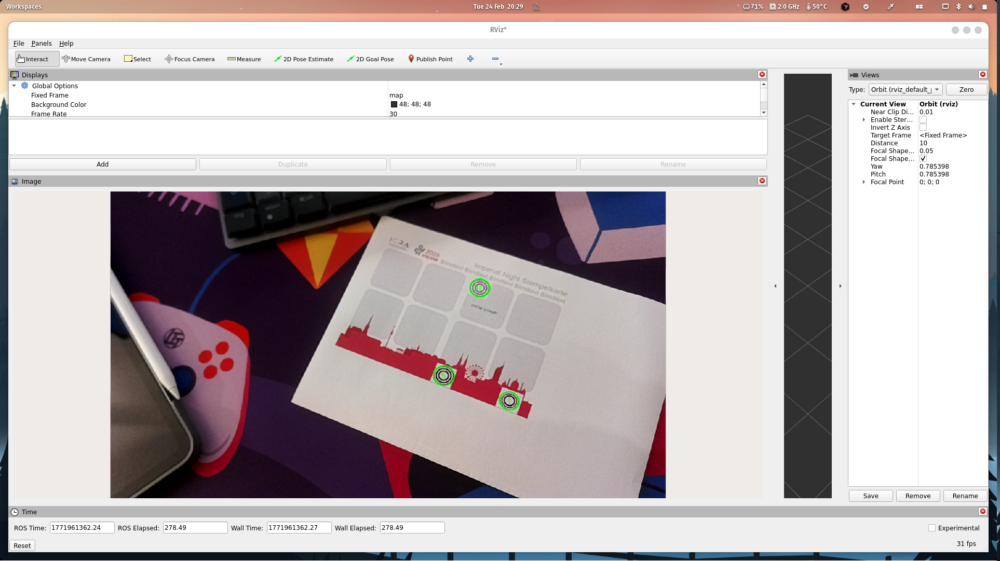

# ICRA Imperial Night Stamp Robot

## Gameplan

1. Some classifier that detects all cards in the robot workspace and determines if they have been stamped or not
2. Coarsely and statically move towards one of the detected cards
3. Use CCTags [Link](https://github.com/alicevision/CCTag) to servo towards the exact stamp field. They shoudl work robustly for estimating a 2D pose on the plane of the card even in bad lighting conditions.
4. Fixed motion for stamping action starting from the end position of the servo towards the marker

---

## Already Completed

* OAK-D ROS 2 Driver (this repo uses Humble)
* CCTag library built and external linking to ROS 2 Node
    Camera -> OAK Node -> RGB and Depth Image Messages -> CCTag Node -> Detection2DArray Message (Marker + ID)

---

---