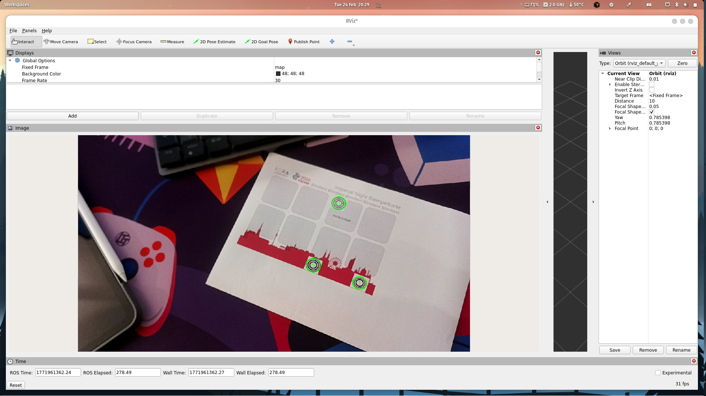

# ICRA Imperial Night Stamp Robot

## Gameplan

1. Some classifier that detects all cards in the robot workspace and determines if they have been stamped or not
2. Coarsely and statically move towards one of the detected cards
3. Use CCTags [Link](https://github.com/alicevision/CCTag) to servo towards the exact stamp field. They shoudl work robustly for estimating a 2D pose on the plane of the card even in bad lighting conditions.
4. Fixed motion for stamping action starting from the end position of the servo towards the marker

---

## Already Completed

* OAK-D ROS 2 Driver (this repo uses Humble)
* CCTag library built and external linking to ROS 2 Node
    Camera -> OAK Node -> RGB and Depth Image Messages -> CCTag Node -> Detection2DArray Message (Marker + ID)
* DINOv2 coarse detection node
* OTASv2 coarse detection node (takes card template and lang prompt)

---

---

# Setup

1. Clone this repo `git clone https://github.com/SimonSchwaiger/stamp_servoing.git`
2. Start container: `bash run_local.sh`. If you want CUDA, you need to modify `./run_local.sh` and change `ghcr.io/simonschwaiger/ros-ml-container:ros2_humble_opensource` to `ghcr.io/simonschwaiger/ros-ml-container:ros2_humble_nvidia`
3. In the container (only on first start): Build CCTAG using `bash $ROS2_WS/src/cctag/scripts/install_cctag.sh`. If you want CUDA, you need to run `CCTAG_WITH_CUDA=ON CUDA_TOOLKIT_DIR=/usr/local/cuda bash $ROS2_WS/src/cctag/scripts/install_cctag.sh`
4. (Optional if CUDA): Change cpu in `requirements.txt` to cu118
5. Run the commands in `container_commands.sh` 
